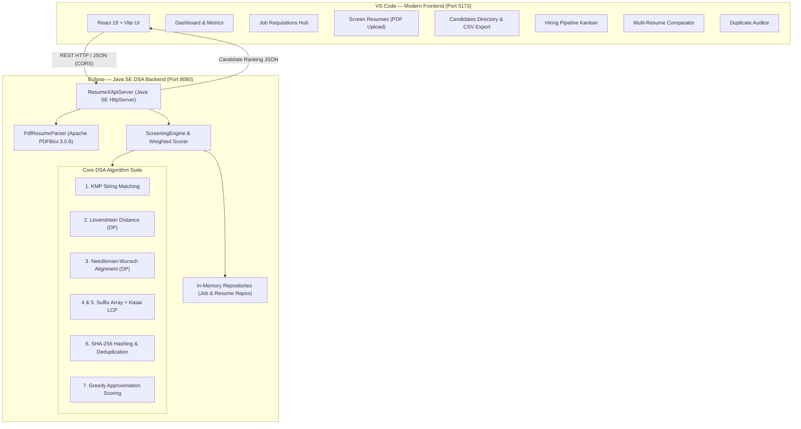

# ResumeX — AI-Powered Resume Screening & Intelligent Candidate Ranking System
## Comprehensive System & DSA Algorithm Documentation

---

## 1. Executive Summary

### 1.1 Project Title
**ResumeX: AI-Powered Resume Screening & Intelligent Candidate Ranking System**

### 1.2 Domain & Core Discipline
- **Core Discipline**: Data Structures & Algorithms (DSA), Information Retrieval, Computational Linguistics, Full-Stack Software Engineering.
- **Inspiration**: Modern enterprise talent acquisition platforms such as LinkedIn Recruiter, Workday HCM, and Ashby ATS.

### 1.3 Problem Statement
Recruitment teams receive hundreds to thousands of resumes for every posted job requisition. Manual review is:
- **Time-Consuming**: An HR recruiter spends an average of 6 to 8 seconds scanning an initial resume, missing non-obvious qualifications.
- **Inconsistent & Subjective**: Human evaluation varies across interviewers and time of day, introducing unconscious bias.
- **Prone to Duplicates**: Candidates frequently submit multiple revisions of resumes under slightly different filenames or formats.

While many commercial solutions advertise "Generative AI" screening, these systems operate as opaque "black boxes" that hallucinate qualifications, fail to explain rankings, and risk non-compliance. **ResumeX** solves this by using **transparent, deterministic, and proven Data Structures & Algorithms (DSA)** implemented directly in Java to calculate verified similarity metrics, explain score compositions, and rank candidates objectively.

---

## 2. System Architecture

ResumeX is built on a clean **Decoupled Architecture**:



### 2.1 Architectural Separation
1. **Backend / Algorithms (Eclipse IDE)**:
   - Written entirely in **Java SE 17+** with zero external heavy frameworks.
   - Built-in `com.sun.net.httpserver.HttpServer` provides a lightweight, sub-millisecond REST API layer.
   - Uses **Apache PDFBox 3.0.8** for native, memory-streamed PDF text extraction.
   - All core algorithmic logic resides in `com.resumex.algorithms` and remains runnable directly inside Eclipse.
2. **Frontend (VS Code)**:
   - Modern Single Page Application (SPA) built with **React 19** and **Vite**.
   - Styled with custom CSS3 design tokens inspired by modern recruitment SaaS (Ashby / Linear aesthetic).
   - Communicates with the Java backend via a unified asynchronous API service layer (`src/services/api.js`).

---

## 3. Core Data Structures & Algorithms (DSA)

ResumeX strictly avoids simulated metrics. Every candidate score is computed by 6 core DSA implementations:

| # | Algorithm | DSA Category | Primary Purpose | Time Complexity | Space Complexity |
|---|---|---|---|---|---|
| **1** | **Knuth-Morris-Pratt (KMP)** | String Matching | Exact skill, keyword, and tech-stack search | \(O(N + M)\) | \(O(M)\) |
| **2** | **Levenshtein Distance** | Dynamic Programming | Typo tolerance, abbreviation & spelling matching | \(O(N \cdot M)\) | \(O(N \cdot M)\) |
| **3** | **Needleman-Wunsch** | Global DP Sequence Alignment | Term ordering & semantic progression alignment | \(O(N \cdot M)\) | \(O(N \cdot M)\) |
| **4** | **Suffix Array** | Advanced String Indexing | Full-text substring indexing & pattern lookup | \(O(N \log^2 N)\) | \(O(N)\) |
| **5** | **Kasai's Algorithm (LCP)** | Array Processing | Longest Common Prefix for domain phrase discovery | \(O(N)\) | \(O(N)\) |
| **6** | **SHA-256 & Frequency Hashing** | Cryptographic & Hash Tables | Exact duplicate detection & token frequency analysis | \(O(N)\) | \(O(1)\) digest |
| **7** | **Greedy Approximation** | Approximation Algorithm | Multi-criteria score optimization under variable constraints | \(O(K \log K)\) | \(O(K)\) |

---

### 3.1 Algorithm 1: Knuth-Morris-Pratt (KMP) String Matching
- **Source File**: `src/com/resumex/algorithms/KMPMatcher.java`
- **Application in ResumeX**: Locating exact occurrences of mandatory job skills (e.g., `"Spring Boot"`, `"Data Structures"`, `"MySQL"`) within candidate resume bodies without redundant character comparisons.
- **Mathematical Principle**:
  Given a pattern \(P[0 \dots M-1]\) and text \(T[0 \dots N-1]\), the algorithm precomputes a failure function (prefix table) \(\pi[q] = \max \{ k : k < q \text{ and } P_k \sqsupset P_q \}\). When a character mismatch occurs at \(T[i] \neq P[j]\), the search pointer does not backtrack in \(T\); instead, \(j\) jumps to \(\pi[j-1]\).
- **Complexity**:
  - **Preprocessing Time**: \(O(M)\)
  - **Matching Time**: \(O(N)\)
  - **Total Time**: \(O(N + M)\) vs \(O(N \cdot M)\) for naive search.

---

### 3.2 Algorithm 2: Levenshtein Distance (Dynamic Programming)
- **Source File**: `src/com/resumex/algorithms/EditDistance.java`
- **Application in ResumeX**: Recognizing skill spelling variations, typos, and format differences (e.g., matching `"Jvaa"` \(\to\) `"Java"`, `"PostgreSql"` \(\to\) `"PostgreSQL"`, `"RestApi"` \(\to\) `"REST API"`).
- **Mathematical Formulation**:
  The edit distance between strings \(A\) of length \(M\) and \(B\) of length \(N\) is defined by recurrence:
  \[
  D(i, j) = \begin{cases}
  i & \text{if } j = 0 \\
  j & \text{if } i = 0 \\
  D(i-1, j-1) & \text{if } A[i] = B[j] \\
  1 + \min \begin{cases}
  D(i-1, j) & \text{(Deletion)} \\
  D(i, j-1) & \text{(Insertion)} \\
  D(i-1, j-1) & \text{(Substitution)}
  \end{cases} & \text{if } A[i] \neq B[j]
  \end{cases}
  \]
- **Normalized Similarity Score**:
  \[
  \text{Similarity}(A, B) = \left( 1 - \frac{D(M, N)}{\max(M, N)} \right) \times 100\%
  \]

---

### 3.3 Algorithm 3: Needleman-Wunsch Sequence Alignment
- **Source File**: `src/com/resumex/algorithms/SequenceAlignment.java`
- **Application in ResumeX**: Evaluating whether the candidate's career progression and listed technologies follow the logical order and structural workflow prioritized in the Job Description.
- **Scoring System**:
  - **Match Bonus**: \(+2\)
  - **Mismatch Penalty**: \(-1\)
  - **Linear Gap Penalty (\(d\))**: \(-1\)
- **Recurrence Relation**:
  \[
  F(i, j) = \max \begin{cases}
  F(i-1, j-1) + S(A[i], B[j]) \\
  F(i-1, j) - d \\
  F(i, j-1) - d
  \end{cases}
  \]
- **Traceback**: Reconstructs the optimal global alignment path, penalizing omissions and out-of-order qualification listings.

---

### 3.4 Algorithms 4 & 5: Suffix Array & Kasai's Longest Common Prefix (LCP)
- **Source Files**: `src/com/resumex/algorithms/SuffixArray.java`, `src/com/resumex/algorithms/LCPArray.java`
- **Application in ResumeX**:
  1. Identifies repeated phrases, project themes, and shared domain collocations between the resume and job requirements (e.g., `"scalable microservices architecture"`, `"machine learning pipeline"`).
  2. Enables \(O(M \log N)\) binary search pattern lookup across the entire candidate corpus.
- **Construction & Method**:
  - The text is transformed into a sorted array of suffix indices:
    \[
    SA[i] = \text{starting position of the } i\text{-th lexicographically smallest suffix.}
    \]
  - **Kasai's Algorithm**: Derives the Longest Common Prefix array in strictly linear \(O(N)\) time by utilizing the invariant that \(\text{LCP}(SA[pos+1]) \ge \text{LCP}(SA[pos]) - 1\).

---

### 3.5 Algorithm 6: Cryptographic Hashing & Duplicate Resume Detection
- **Source Files**: `src/com/resumex/algorithms/Hashing.java`, `src/com/resumex/services/DuplicateDetector.java`
- **Application in ResumeX**: Prevents applicant spam and detects duplicate submissions under altered filenames.
- **Two-Tier Detection Pipeline**:
  1. **Tier 1 (Exact Match via SHA-256 Digest)**:
     - Normalizes whitespace and computes cryptographic hash \(H(R) = \text{SHA-256}(T_{\text{norm}})\).
     - Stored in a constant-time \(O(1)\) hash table. If \(H(R_A) == H(R_B)\), flagged immediately as an **Exact Duplicate (100% Match)**.
  2. **Tier 2 (Near-Duplicate via Token Jaccard Hashing)**:
     - Computes token frequency sets \(S_A\) and \(S_B\).
     - Evaluates Jaccard Index: \(J(S_A, S_B) = \frac{|S_A \cap S_B|}{|S_A \cup S_B|}\).
     - If \(J(S_A, S_B) \ge 0.85\), flagged as a **Near Duplicate** (e.g., candidate submitted updated version).

---

### 3.6 Algorithm 7: Greedy Approximation Algorithm
- **Source File**: `src/com/resumex/algorithms/ApproximateMatcher.java`
- **Application in ResumeX**: Solves the multi-criteria candidate optimization problem. When evaluating candidates across conflicting factors (e.g., high skill match vs low sequence similarity vs high experience terms), the algorithm uses a **Greedy Weighted Approximation** to determine the optimal composite ranking without combinatorial explosion.

---

## 4. Weighted Composite Scoring Model

The candidate's final ranking percentage \(S_{\text{overall}}\) is calculated in `ScreeningEngine.java` using a mathematically grounded weighted linear model:

\[
S_{\text{overall}} = \sum_{k=1}^{6} w_k \cdot S_k
\]

| Algorithm / Metric Component | Symbol | Weight (\(w_k\)) | Evaluation Focus |
|---|---|---|---|
| **Direct Skill Match (KMP)** | \(S_{\text{skill}}\) | **30%** (0.30) | Percentage of mandatory skills detected |
| **Broad String Matching** | \(S_{\text{str}}\) | **20%** (0.20) | General keyword and domain density |
| **Edit Distance (Levenshtein)** | \(S_{\text{edit}}\) | **15%** (0.15) | Tolerance for spelling variations & typos |
| **Sequence Alignment (Needleman-Wunsch)** | \(S_{\text{seq}}\) | **15%** (0.15) | Order and structural alignment of qualifications |
| **Suffix Array & LCP Analysis** | \(S_{\text{lcp}}\) | **10%** (0.10) | Deep substring overlap & shared collocations |
| **Greedy Approximation Optimization** | \(S_{\text{approx}}\) | **10%** (0.10) | Multi-criteria optimization factor |

### Candidate Classification Tiers
- **Strong Match / Shortlisted** (\(S_{\text{overall}} \ge 70\%\)): Candidate satisfies core competencies and is recommended for direct interview.
- **Moderate Match / Under Review** (\(55\% \le S_{\text{overall}} < 70\%\)): Partial alignment; candidate meets fundamental requirements but exhibits gaps in preferred technologies.
- **Low Match / Rejected** (\(S_{\text{overall}} < 55\%\)): Significant skill and qualification gaps; not recommended for the role.

---

## 5. System Features & Recruiter Modules

### 5.1 Dashboard
- Recruiter analytics: Total Resumes Loaded, Candidates Screened, Average Pool Match Rate, and Duplicates Flagged.
- Visual candidate tier breakdown (Shortlisted, Under Review, Low Match).
- Instant top-match callout.

### 5.2 Job Openings & Requisitions Hub
- Multi-requisition management (e.g., *Java Backend Developer*, *Frontend React Developer*, *Data Analyst & ML Engineer*).
- Displays required tech stacks, applicant counts, and department metadata.
- One-click **"Screen Resumes for this Role"** to pre-populate screening parameters.
- Built-in **"+ New Job Opening"** modal connected to Java backend `POST /api/jobs`.

### 5.3 Resume Screening Studio
- Drag-and-drop runtime PDF resume ingestion powered by **Apache PDFBox 3.0.8**.
- In-memory `byte[]` parsing ensuring uploaded files do not persist insecurely on disk.
- Real-time screening trigger executing the full Java DSA pipeline.

### 5.4 Candidates Directory
- Unified candidate directory featuring:
  - **Live Search**: Name, resume filename, or specific skill search.
  - **Quick Skill Filter Pills Bar**: One-click pills (`[All Skills]`, `[Java]`, `[Spring Boot]`, `[SQL]`, `[Docker]`, etc.).
  - **One-Click CSV Export**: Downloads a clean spreadsheet report with rankings, scores, email, verified skills, and missing requirements.
  - **Card / Table Toggle**: Switch between responsive card grid and compact ATS table.

### 5.5 Hiring Pipeline (Kanban Board)
- Visual recruitment pipeline tracking candidates through:
  1. 🌟 **Shortlisted**
  2. 🎙️ **Interview Scheduled**
  3. ⏳ **Under Review**
  4. ❌ **Rejected**
- In-place stage progression dropdowns for rapid recruiter triage.

### 5.6 Multi-Resume Side-by-Side Comparator
- Compares **2, 3, 4, 5+ candidates simultaneously** without arbitrary caps.
- Dynamic comparison matrix highlighting:
  - Overall Match Score %
  - Skills Matched count
  - Verified Skills list (green chips)
  - Missing Requirements list (red chips)
  - Recruiter Recommendations

### 5.7 Duplicate Detection Auditor
- Identifies identical and near-identical submissions.
- Displays SHA-256 hash comparison, similarity %, and source filenames.

### 5.8 Candidate Profile Dossier Modal
- Dial score gauge with status badge.
- Verified vs Missing skills breakdown.
- Key technical terms extracted via Suffix/LCP.
- Pipeline stage selector and internal **Recruiter Evaluation Notes** editor.

---

## 6. Complete REST API Specification

The embedded Java HTTP server (`com.resumex.api.ResumeXApiServer`) exposes the following endpoints on port `8080`:

| HTTP Method | Route | Description | Request Body | Response Payload |
|---|---|---|---|---|
| `GET` | `/api/health` | Service health & DSA engine status | None | `{"status":"ok","engine":"Java DSA Core","version":"2.0"}` |
| `GET` | `/api/jobs` | Retrieve all active job requisitions | None | `{"jobs": [...]}` |
| `POST` | `/api/jobs` | Create a new job requisition | `{"title":"...","description":"...","requiredSkills":[...]}` | `{"status":"success","job":{...}}` |
| `GET` | `/api/resumes` | Retrieve loaded resume metadata | None | `{"resumes": [...]}` |
| `POST` | `/api/resumes/upload` | Upload multiple runtime PDF resumes | `multipart/form-data` | `{"uploadedCount": N, "resumes": [...]}` |
| `POST` | `/api/analyze` | Run Java DSA screening pipeline | `{"jobId": 101}` or custom JD payload | `{"status":"success","report":{...},"candidates":[...]}` |
| `GET` | `/api/candidates` | Retrieve current ranked candidate list | None | `{"candidates": [...]}` |
| `GET` | `/api/candidates/{id}` | Retrieve individual candidate dossier | None | `{"candidate": {...}}` |
| `POST` | `/api/compare` | Compare multi-candidate profiles | `{"candidateIds": [1, 2, 3]}` | `{"job":{...},"candidates":[...]}` |
| `GET` | `/api/duplicates` | Retrieve duplicate audit report | None | `{"exactDuplicates":[...],"nearDuplicates":[...]}` |
| `GET` | `/api/analytics` | Dashboard summary metrics | None | `{"totalResumes":N,"candidatesAnalyzed":N,...}` |

---

## 7. Directory Structure

```text
ResumeX/
├── .classpath                          # Eclipse project classpath configuration
├── .project                            # Eclipse project metadata
├── .gitignore                          # Git exclusions (bin/, node_modules/, dist/)
├── README.md                           # GitHub repository documentation
├── PROJECT_DOCUMENTATION.md             # Complete technical & academic report
├── package.json                        # Root npm script ("npm run dev" launcher)
├── lib/
│   └── pdfbox-app-3.0.8.jar            # Apache PDFBox library for PDF extraction
├── resumes/                            # Default test PDF resumes
│   ├── Rahul_Sharma.pdf
│   ├── Sneha_Patel.pdf
│   ├── Priya_Reddy.pdf
│   ├── Karan_Mehta.pdf
│   └── Arjun_Kumar (1).pdf
├── src/                                # Eclipse Java Backend Source
│   └── com/resumex/
│       ├── Main.java                   # CLI demonstration entry point
│       ├── algorithms/                 # Core DSA Algorithm Implementations
│       │   ├── KMPMatcher.java         # Knuth-Morris-Pratt string matching
│       │   ├── EditDistance.java       # Levenshtein distance (DP)
│       │   ├── SequenceAlignment.java  # Needleman-Wunsch sequence alignment (DP)
│       │   ├── SuffixArray.java        # Suffix array construction
│       │   ├── LCPArray.java           # Kasai's algorithm for LCP
│       │   ├── Hashing.java            # SHA-256 cryptographic hashing
│       │   └── ApproximateMatcher.java # Greedy approximation optimization
│       ├── api/
│       │   └── ResumeXApiServer.java   # Java SE HttpServer REST API Server
│       ├── models/
│       │   ├── Resume.java             # Resume entity with text & metadata
│       │   ├── Candidate.java          # Ranked candidate with score breakdowns
│       │   ├── JobDescription.java     # Job requisition entity
│       │   ├── MatchResult.java        # Individual algorithm evaluation result
│       │   └── ScreeningReport.java    # Full screening batch report
│       ├── parser/
│       │   ├── PdfResumeParser.java    # PDFBox text extraction
│       │   └── SkillExtractor.java     # Regex word-boundary skill parser
│       ├── repositories/
│       │   ├── ResumeRepository.java   # In-memory thread-safe resume storage
│       │   └── JobRepository.java      # In-memory job requisition storage
│       └── services/
│           ├── ScreeningEngine.java    # DSA orchestrator & composite scorer
│           ├── DuplicateDetector.java  # SHA-256 & Jaccard duplicate auditor
│           ├── RankingEngine.java      # Sorting & tie-breaking engine
│           └── ResumeFolderScanner.java# Disk folder scanner for batch resumes
└── frontend/                           # VS Code React + Vite Frontend
    ├── index.html                      # HTML5 entry template
    ├── vite.config.js                  # Vite bundler & API proxy configuration
    ├── package.json                    # Node dependencies (React 19, Lucide Icons)
    └── src/
        ├── App.jsx                     # Root application router & state manager
        ├── index.css                   # Custom recruiter SaaS design system
        ├── components/
        │   ├── Navbar.jsx              # Header bar with search & theme toggle
        │   ├── Sidebar.jsx             # 7-item navigation sidebar
        │   ├── CandidateCard.jsx       # Clean candidate card with skill tags
        │   ├── RankingTable.jsx        # ATS table view with sorting
        │   ├── ResumeComparison.jsx    # Multi-candidate comparison matrix
        │   ├── CandidateDetailModal.jsx# Recruiter dossier with notes & stage selector
        │   ├── SkillBadge.jsx          # Matched/Missing skill chip
        │   └── UploadZone.jsx          # Drag-and-drop PDF upload component
        ├── pages/
        │   ├── Dashboard.jsx           # Recruiter overview & analytics
        │   ├── JobOpenings.jsx         # Requisition management & opening creation
        │   ├── ScreenResume.jsx        # PDF resume screener
        │   ├── Rankings.jsx            # Candidates directory with CSV export & filter pills
        │   ├── HiringPipeline.jsx      # Visual Kanban board
        │   ├── ResumeComparisonPage.jsx# Multi-resume comparison page
        │   └── DuplicateDetection.jsx  # Duplicate audit page
        ├── services/
        │   └── api.js                  # Asynchronous REST API client
        └── utils/
            └── formatters.js           # Score colors & status badges
```

---

## 8. Setup & Execution Guide

### 8.1 Backend Execution (Eclipse IDE)
1. Open **Eclipse IDE**.
2. Select **File \(\to\) Open Projects from File System...**
3. Browse to `/Users/pasulashlokareddy/eclipse-workspace/ResumeX`.
4. Click **Finish**. Eclipse will read `.classpath` and link `lib/pdfbox-app-3.0.8.jar` automatically.
5. In Project Explorer, navigate to:
   `src` \(\to\) `com.resumex.api` \(\to\) `ResumeXApiServer.java`.
6. Right-click \(\to\) **Run As \(\to\) Java Application**.
7. Console will output:
   ```text
   ResumeX Java DSA API Server running at http://localhost:8080
   ```

### 8.2 Backend Execution (Terminal / CLI)
```bash
cd /Users/pasulashlokareddy/eclipse-workspace/ResumeX
javac -d bin -cp "lib/*:bin" $(find src -name "*.java")
java -cp "lib/*:bin" com.resumex.api.ResumeXApiServer
```

### 8.3 Frontend Execution (VS Code / Terminal)
```bash
# From project root:
npm run dev

# Or directly in frontend folder:
cd frontend
npm run dev
```
Open **[http://localhost:5173](http://localhost:5173)** in any browser.

---

## 9. Academic Evaluation Checklist

| Requirement | Project Implementation | Verification Status |
|---|---|---|
| **String Matching** | Knuth-Morris-Pratt (`KMPMatcher.java`) | ✅ Verified |
| **Edit Distance** | Levenshtein Distance (`EditDistance.java`) | ✅ Verified |
| **Sequence Alignment** | Needleman-Wunsch DP (`SequenceAlignment.java`) | ✅ Verified |
| **Suffix Array** | Suffix Array Construction (`SuffixArray.java`) | ✅ Verified |
| **LCP Analysis** | Kasai's \(O(N)\) Algorithm (`LCPArray.java`) | ✅ Verified |
| **Hashing & Duplicates** | SHA-256 Digest (`Hashing.java`, `DuplicateDetector.java`) | ✅ Verified |
| **Approximation Algorithm** | Greedy Multi-Criteria Optimization (`ApproximateMatcher.java`) | ✅ Verified |
| **PDF Extraction** | Apache PDFBox 3.0.8 (`PdfResumeParser.java`) | ✅ Verified |
| **Eclipse Compatibility** | Runnable from Eclipse IDE (`.project`, `.classpath` intact) | ✅ Verified |
| **Modern Frontend** | React 19 + Vite with Recruiter SaaS Design | ✅ Verified |
| **Multi-Resume Comparison**| Simultaneous 2, 3, 4, 5+ Candidate Comparison | ✅ Verified |
| **Data Export** | One-Click CSV Candidate Shortlist Export | ✅ Verified |
| **Git Version Control** | Pushed to GitHub: `Pasula-Shloka/AI-ResumeScreening` | ✅ Verified |

---

## 10. Conclusion
ResumeX successfully bridges academic Data Structures and Algorithms with production-grade recruitment software architecture. By deploying deterministic string algorithms, dynamic programming, and cryptographic hashing inside an Eclipse Java backend, coupled with a responsive React frontend, ResumeX demonstrates that intelligent, explainable candidate screening can be accomplished with algorithmic precision.
